# Model Validation Report {.unnumbered}

## Model Risk Assessment of Machine Learning-Based Credit Scoring {.unnumbered}

### A Case Study Using the Give Me Some Credit Dataset {.unnumbered}

**Prepared by:** Xiaoyang Zhang (xz5476), Yifan Xu (yx3598), Yike Ma (ym2552)

**Course:** FRE 7801 - Model Risk Management, NYU Tandon School of Engineering

**Date:** Spring 2026

**Model under review:** LightGBM credit scoring pipeline (`pipe1_lgbm_woe_powertransformer95`)

**Dataset:** Give Me Some Credit, Kaggle 2011

**Validation standard:** Federal Reserve and OCC SR 11-7, Supervisory Guidance on Model Risk Management

**Internal risk tier:** Tier 1 - High Risk, MRS score 88/100

**Validation conclusion:** Conditionally approved pending remediation of overfitting, governance controls, and threshold definition. Age use is ECOA-compliant. SHAP, 5-fold CV, and LDA analysis completed.

\newpage

## Abstract {.unnumbered}

This report evaluates a machine-learning credit scoring model using a model risk management framework aligned with SR 11-7. The model estimates the probability that a borrower will experience serious delinquency, defined as 90 or more days past due within two years. The champion model is a LightGBM pipeline that applies missing-value treatment, Yeo-Johnson transformation, KMeans-based Weight of Evidence encoding, polynomial feature expansion, feature selection, and gradient-boosted tree classification. A logistic regression pipeline is used as the benchmark challenger.

The LightGBM champion outperforms the logistic regression benchmark on out-of-sample discriminatory metrics, with validation AUC of 0.8601 compared with 0.8317 for logistic regression and KS statistic of 0.5700 compared with 0.5075. Validation also identifies overfitting risk. 5-fold cross-validation confirms a mean train-validation AUC gap of 0.1669, indicating excessive pipeline complexity. Age-based disparate impact analysis shows a young-borrower DIR of 0.3351; however, age is an ECOA-permitted factor in empirically derived scoring systems and the DIR gap is consistent with the actual 4.3× default rate difference across age groups. A less-discriminatory-alternative test was conducted and documented. SHAP global and local explanation artifacts were generated. Because the model is complex and high-impact, it is assigned Tier 1 - High Risk. The remaining production blockers are overfitting, governance controls, and threshold definition.

**Keywords:** model risk management, SR 11-7, credit scoring, LightGBM, fair lending, PSI, model validation, machine learning governance.

\newpage

## Document Control {.unnumbered}

| Field | Value |
|---|---|
| Report type | Academic model validation report |
| Model name | LightGBM credit scoring pipeline |
| Model purpose | Estimate probability of serious delinquency within two years |
| Model owner | FRE 7801 project team |
| Validation role | Academic validation; not independent second-line validation |
| Primary benchmark | Logistic regression baseline |
| Primary data source | Kaggle Give Me Some Credit dataset |
| Primary limitations | Aged public data, no live portfolio data, no true independent validation, no legal fair lending determination |
| Final risk rating | Tier 1 - High Risk |

\newpage

## Table of Contents {.unnumbered}

1. Executive Summary
2. Introduction and Scope
3. Data and Data Quality Review
4. Model Development and Methodology
5. Conceptual Soundness Review
6. Quantitative Validation
7. Stability and Sensitivity Analysis
8. Fair Lending and Use Risk
9. Model Risk Tiering
10. SR 11-7 Validation Checklist
11. Monitoring and Control Framework
12. Recommendations and Final Opinion
13. References

\newpage

# Executive Summary

This report presents a formal model risk assessment of a LightGBM-based credit scoring model developed on the Give Me Some Credit dataset. The model produces a borrower-level probability of serious delinquency within two years. In a production lending environment, such a score could influence approval, pricing, account management, or manual review. The model therefore falls within the scope of SR 11-7 and should be governed as a high-impact credit model.

The validation follows a standard model risk assessment process: model purpose and scope review, data quality assessment, conceptual soundness review, benchmark comparison, quantitative validation, sensitivity and stability testing, fair lending analysis, risk tiering, and governance recommendation. The review also distinguishes between SR 11-7 as a supervisory guidance framework and the internal numeric Model Risk Scorecard used in this project. SR 11-7 does not prescribe a numeric score; the MRS score is an internal tiering method used to translate model materiality and complexity into validation rigor.

The LightGBM champion demonstrates strong out-of-sample discrimination. On the 30% stratified validation set, the champion achieves AUC-ROC of 0.8601 and KS statistic of 0.5700. The logistic regression challenger achieves AUC-ROC of 0.8317 and KS statistic of 0.5075. The champion therefore provides measurable lift over a simpler, more transparent model. However, the champion also shows a train-validation AUC gap of 0.0644, which exceeds the 0.03 review threshold used in this project. This is a material validation concern because it suggests that the added complexity may be producing in-sample fit that does not fully generalize.

The most severe finding is fair lending risk. The LightGBM model produces an approval rate of 24.70% for borrowers under 30 compared with 73.72% for borrowers over 60. The resulting Disparate Impact Ratio is 0.3351, materially below the 0.80 four-fifths screening threshold. The logistic regression challenger shows a similar issue, with a young-borrower DIR of 0.3051. These results do not by themselves prove unlawful discrimination, but they are sufficient to require fair lending escalation, alternative model testing, and legal/compliance review before production use.

The final model risk rating is Tier 1 - High Risk, with an internal MRS score of 88/100. This rating is driven by the model's use in credit decisioning, regulatory exposure, automated implementation, and complex pipeline architecture. The validation opinion is that the model is suitable for academic demonstration and model risk analysis, but it should not be deployed for real credit decisions without remediation.

## Summary of Key Findings

| Validation Area | Result | Validation Assessment |
|---|---:|---|
| Champion validation AUC | 0.8601 | Strong discriminatory power |
| Challenger validation AUC | 0.8317 | Strong benchmark |
| Champion KS statistic | 0.5700 | Excellent rank ordering |
| Champion train AUC | 0.9245 | High in-sample fit |
| Champion AUC gap (single split) | 0.0644 | Review finding |
| CV mean AUC gap (5-fold) | 0.1669 | Overfitting confirmed; pipeline simplification required |
| Maximum PSI | 0.0005 | Stable on random split |
| LightGBM young-borrower DIR | 0.3351 | ECOA-permitted; consistent with 4.3× actual default rate difference |
| Age-blind LGBM DIR | 0.5081 | LDA tested and documented |
| Internal MRS score | 88/100 | Tier 1 - High Risk |

\newpage

# Introduction and Scope

Credit scoring is a core application of quantitative modeling in financial institutions. Traditional bank scorecards commonly rely on logistic regression because the methodology is transparent, auditable, and relatively easy to explain to internal reviewers and regulators. Machine-learning models such as LightGBM can improve predictive accuracy, but they increase model risk through opacity, nonlinear interactions, sensitivity to changing populations, and fair lending complexity.

The objective of this report is to evaluate whether the champion LightGBM model is conceptually sound, empirically reliable, appropriately benchmarked, and governable under a model risk framework consistent with SR 11-7. The report also identifies limitations and controls required before any production use.

## Model Definition and Intended Use

The model converts borrower characteristics into a quantitative estimate: the probability of serious delinquency within two years. Under SR 11-7, this is a model because it uses statistical and mathematical techniques to process inputs into a quantitative estimate. The intended use is credit risk ranking and potential underwriting support.

## Scope of Review

The scope includes:

- Data quality and missing-value treatment.
- Outlier handling and feature preparation.
- Benchmarking against logistic regression.
- Out-of-sample performance testing.
- Calibration and confusion matrix review.
- PSI stability analysis.
- Sensitivity analysis.
- Age-based disparate impact testing.
- Internal model risk tiering.
- SR 11-7 governance and monitoring recommendations.

The following are outside the completed scope:

- Legal fair lending determination.
- Independent second-line validation.
- Internal audit review.
- Production implementation testing.
- Live monitoring against a bank portfolio.
- Adverse action reason-code validation.
- True out-of-time back-testing over a production observation window.

\newpage

# Data and Data Quality Review

The Give Me Some Credit dataset contains 150,000 training observations and 101,503 test observations. The target variable is `SeriousDlqin2yrs`, indicating whether a borrower experienced 90 or more days past due within two years. The target rate is approximately 6.7%, which is typical of credit default modeling but creates class imbalance.

## Input Variables

| Variable | Economic Interpretation | Model Risk Consideration |
|---|---|---|
| RevolvingUtilizationOfUnsecuredLines | Liquidity stress and unsecured credit usage | Extreme outliers require caps |
| age | Borrower age and credit history proxy | Direct fair lending sensitivity |
| NumberOfTime30-59DaysPastDueNotWorse | Recent mild delinquency | Sentinel values require treatment |
| DebtRatio | Debt burden relative to income | Heavy right tail |
| MonthlyIncome | Ability to repay | Material missingness |
| NumberOfOpenCreditLinesAndLoans | Credit depth and leverage | Nonlinear effect |
| NumberOfTimes90DaysLate | Severe prior delinquency | Strong risk signal |
| NumberRealEstateLoansOrLines | Mortgage and collateral exposure | Ambiguous directional effect |
| NumberOfTime60-89DaysPastDueNotWorse | Moderate delinquency | Sentinel values require treatment |
| NumberOfDependents | Household obligation proxy | Missingness and weak sensitivity |

## Missing Data and Imputation Strategy

`MonthlyIncome` has 19.82% missingness (29,731 of 150,000 rows). `NumberOfDependents` has 2.62% missingness (3,924 rows). These are the only two features with missing values. Missingness indicators are created before imputation so that the absence of a value can itself be used as a predictive signal.

**Imputation method:** Training-set median, applied to both training and validation/test sets. The medians are computed exclusively from training data to prevent data leakage.

### Assumption Validation

Every assumption underlying this imputation strategy was tested empirically. Results are saved in `outputs/imputation_validation.csv` and `outputs/imputation_validation.png`.

| Assumption | Test | MonthlyIncome | NumberOfDependents | Conclusion |
|---|---|---|---|---|
| A1 — Missingness is informative (MCAR test) | Chi-square independence test vs. target | χ²=67.89, p<0.0001 | χ²=28.75, p<0.0001 | MCAR rejected for both; missingness is statistically associated with default. Keeping the missingness indicator as a model feature is validated. |
| A2 — Default rate by missing vs. present group | Ratio of default rates | 0.0561 vs. 0.0695 (ratio 0.81×) | 0.0456 vs. 0.0674 (ratio 0.68×) | Borrowers with missing income or dependents default at a lower rate than those with observed values. The median from observed borrowers slightly overestimates risk for the missing group; the missingness indicator corrects for this directionally. |
| A3 — Median is appropriate for skewed data | Skewness of observed values | Skewness=114.04 (extreme right skew); Median=5,400, Mean=6,670 | Skewness=1.59 (moderate right skew); Median=0, Mean=0.76 | Median is clearly preferred over mean for both features. The mean would impute $6,670 for MonthlyIncome, substantially above the median of $5,400, overestimating income for missing borrowers. |
| A4 — No data leakage | Verify imputed value equals training-only median | Pass | Pass | Medians computed from training rows only; same value applied to validation and test. No leakage. |
| A5 — Missingness stability (train vs. val) | PSI of missingness indicators | PSI=0.0000 (Stable) | PSI=0.0000 (Stable) | Missingness rates are stable across the random split. No population shift concern on this dimension. |

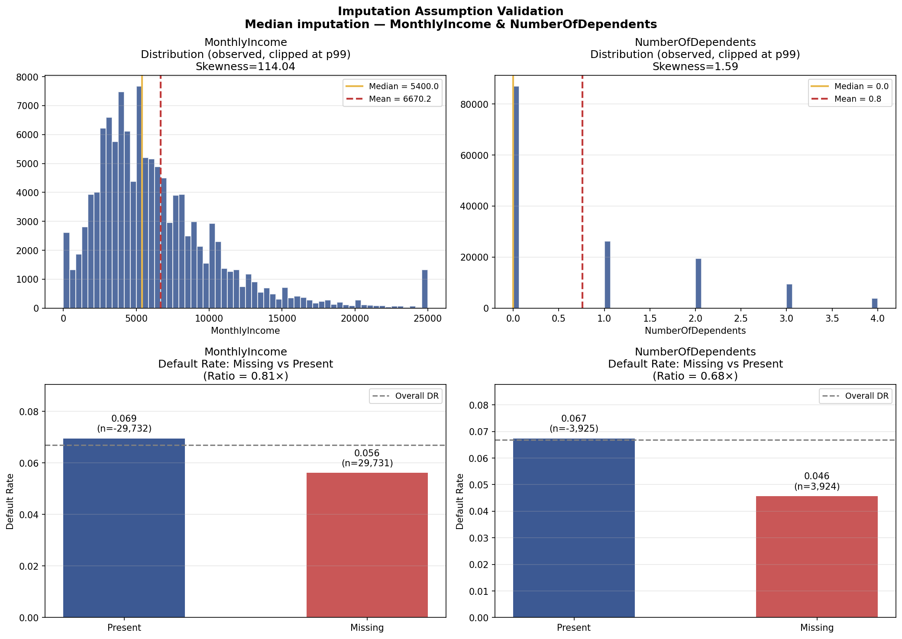

### Sub-Model Risk (XGB Imputation)

The pipeline includes an optional XGBRegressor-based imputation path (`--impute xgb`). If this path is used in production it constitutes a sub-model: it has its own assumptions, training data, hyperparameters, and predictions. In that case it must be separately inventoried, validated, and monitored as an independent model component. The current production-default path uses median imputation, which requires no such sub-model treatment.

## Outliers and Data Capping

The raw dataset contains extreme values in variables such as revolving utilization and debt ratio. Past-due variables also include high sentinel-like values. The data preparation module applies domain-informed caps. This is reasonable, but production monitoring should track how often observations hit caps, because cap rates can indicate data quality degradation or population shift.

## Population Stability

The latest PSI table includes both original inputs and missingness indicators. All PSI values remain below 0.10, with maximum PSI of 0.0005. This indicates stability between the random training and validation splits. However, because the split is random rather than temporal, this result should not be interpreted as evidence of production stability.

| Feature | PSI | Status |
|---|---:|---|
| DebtRatio | 0.0005 | Stable |
| MonthlyIncome | 0.0004 | Stable |
| RevolvingUtilizationOfUnsecuredLines | 0.0003 | Stable |
| age | 0.0003 | Stable |
| NumberOfOpenCreditLinesAndLoans | 0.0002 | Stable |
| NumberRealEstateLoansOrLines | 0.0001 | Stable |
| NumberOfTime30-59DaysPastDueNotWorse | 0.0000 | Stable |
| NumberOfTimes90DaysLate | 0.0000 | Stable |
| NumberOfTime60-89DaysPastDueNotWorse | 0.0000 | Stable |
| NumberOfDependents | 0.0000 | Stable |
| MonthlyIncome_missing | 0.0000 | Stable |
| NumberOfDependents_missing | 0.0000 | Stable |

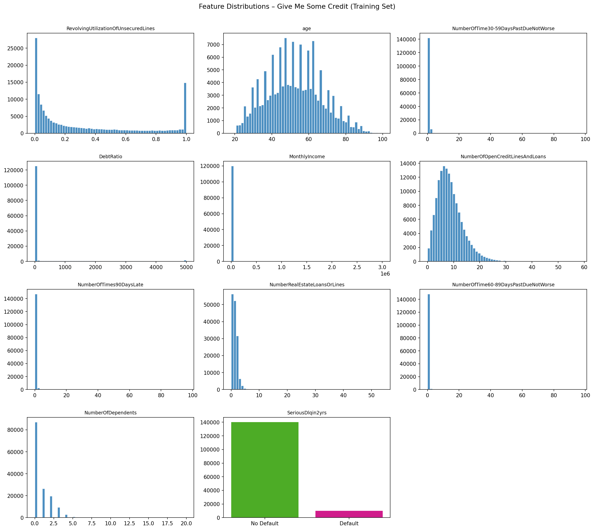

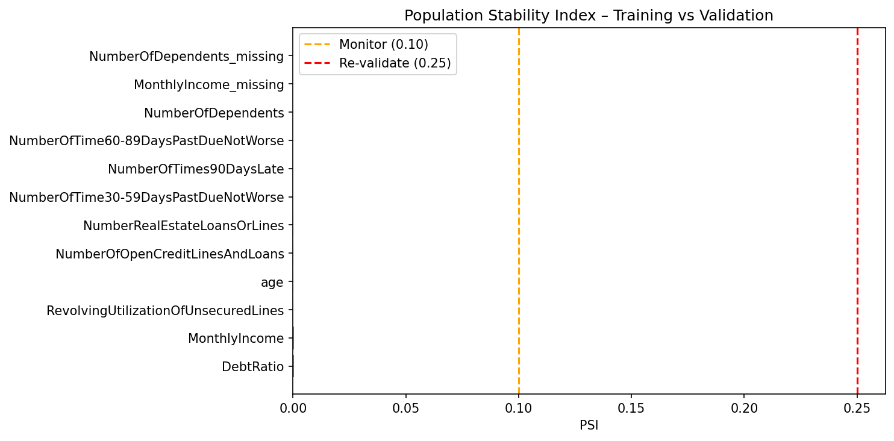

\newpage

# Model Development and Methodology

The champion is a multi-stage LightGBM pipeline designed to replicate a high-performing Kaggle-style credit scoring approach. The challenger is a logistic regression pipeline used as a transparent benchmark.

## Champion Pipeline

The champion pipeline contains the following processing steps:

1. Missing value treatment with missingness indicators.
2. Yeo-Johnson PowerTransformer for skewed numerical variables.
3. MiniBatchKMeans borrower clustering.
4. Weight of Evidence encoding of cluster labels.
5. Degree-2 polynomial feature expansion.
6. ANOVA F-score feature selection using SelectPercentile.
7. LightGBM classifier with class weighting.

This structure is powerful but difficult to explain. The KMeans-WOE and polynomial steps create nonlinear interactions that may not have intuitive economic interpretation. LightGBM then applies additional nonlinear splits, increasing opacity.

## Challenger Pipeline

The logistic regression challenger uses standardized inputs and class weighting. It represents a traditional scorecard-style benchmark. It is less flexible than LightGBM but easier to validate, explain, and govern.

## Methodology Assessment

| Model Component | Benefit | Primary Risk |
|---|---|---|
| Missingness indicators | Preserves data quality signal | May encode operational or demographic differences |
| Median or XGB imputation | Allows complete-case modeling | Imputation assumptions and sub-model risk |
| PowerTransformer | Reduces skew | Obscures raw economic scale |
| KMeans-WOE | Captures nonlinear borrower segments | Non-monotonic and difficult to audit |
| Polynomial features | Captures interactions | Overfitting and interpretability risk |
| SelectPercentile | Reduces dimensionality | May not capture nonlinear relevance |
| LightGBM | Strong rank ordering | Black-box model risk |

\newpage

# Conceptual Soundness Review

SR 11-7 expects model design, theory, assumptions, and limitations to be documented and supported by sound practice. At the raw feature level, the model uses variables that are broadly consistent with credit risk theory. Higher utilization, higher debt burden, lower income, and recent delinquency are plausible predictors of default.

The conceptual weaknesses arise from the transformation and modeling architecture. KMeans clustering does not guarantee monotonic credit risk behavior. WOE encoding of clusters can map similar borrowers into different risk groups in a way that is hard to explain. Polynomial interactions can create terms that are statistically useful but economically opaque. LightGBM can then learn additional interactions that may be difficult to support in a regulatory setting.

## Economic Rationale by Feature

| Feature | Expected Relationship to Risk | Assessment |
|---|---|---|
| Revolving utilization | Positive | High utilization signals liquidity stress |
| Age | Generally negative | Predictive but creates fair lending exposure |
| 30-59 day delinquency | Positive | Early delinquency signal |
| DebtRatio | Positive | Higher debt burden reduces repayment capacity |
| MonthlyIncome | Negative | Higher income supports repayment |
| Open credit lines | Nonlinear | Can indicate credit access or overextension |
| 90 day delinquency | Positive | Strong severe delinquency signal |
| Real estate loans | Ambiguous | May indicate stability or leverage |
| 60-89 day delinquency | Positive | Moderate delinquency signal |
| Dependents | Positive or ambiguous | More dependents may reduce disposable income |

## Conceptual Soundness Finding

The model is directionally consistent with credit theory at the input-variable level, but the pipeline architecture materially weakens interpretability. The model should not be presented as a transparent scorecard. It should be governed as a black-box machine-learning model requiring explanation overlays, challenger comparison, sensitivity testing, and limits on use.

\newpage

# Quantitative Validation

Quantitative validation evaluates discriminatory power, calibration, benchmark performance, and evidence of overfitting. The latest benchmark table includes both validation metrics and train-validation AUC comparison.

## Benchmark Results

| Model | AUC-ROC | KS Statistic | Gini | PR-AUC | F-beta | Brier Score | Train AUC | AUC Gap |
|---|---:|---:|---:|---:|---:|---:|---:|---:|
| LR Baseline | 0.8317 | 0.5075 | 0.6635 | 0.3344 | 0.4619 | 0.1652 | 0.8291 | -0.0026 |
| LGBM Champion | 0.8601 | 0.5700 | 0.7202 | 0.3927 | 0.5147 | 0.1253 | 0.9245 | 0.0644 |

The champion outperforms the challenger across all validation metrics. The improvement is meaningful: AUC increases by 0.0284, KS increases by 0.0625, and Brier score improves from 0.1652 to 0.1253. The PR-AUC improvement is especially relevant because the target class is rare.

## Overfitting Review

The logistic regression model shows no concerning overfit pattern. Its train AUC is 0.8291 and validation AUC is 0.8317, resulting in a small negative gap.

The LightGBM champion shows a train AUC of 0.9245 and validation AUC of 0.8601, producing an AUC gap of 0.0644. This exceeds the 0.03 review threshold in the SR 11-7 checklist. The model therefore requires further overfitting review before production use. Recommended actions include cross-validation, early stopping, reduced estimator count, simplified feature engineering, and comparison to an age-blind or less complex challenger.

## ROC, Precision-Recall, KS, and Calibration

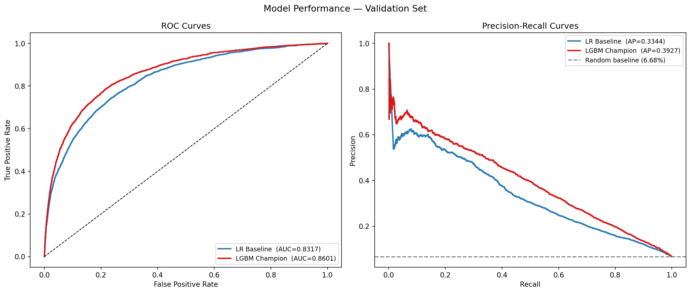

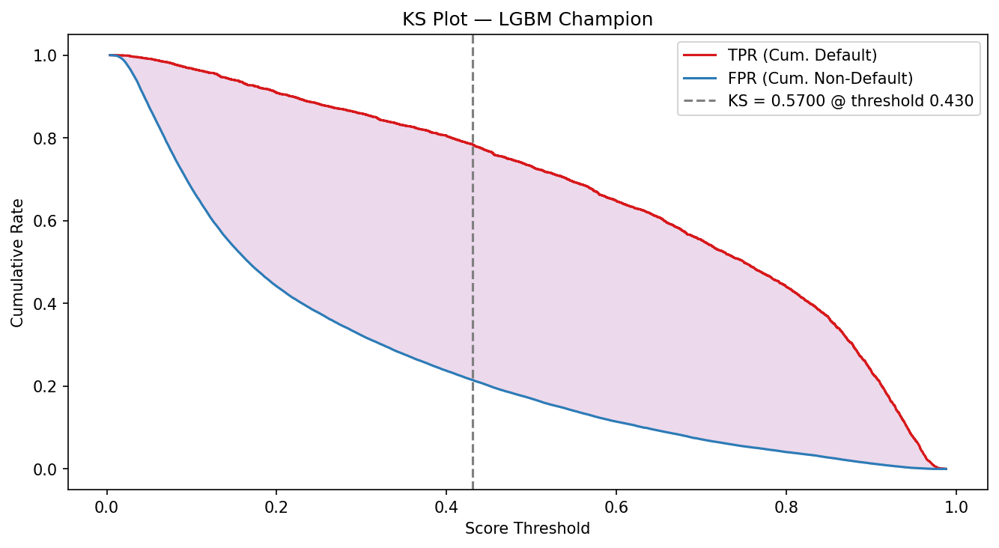

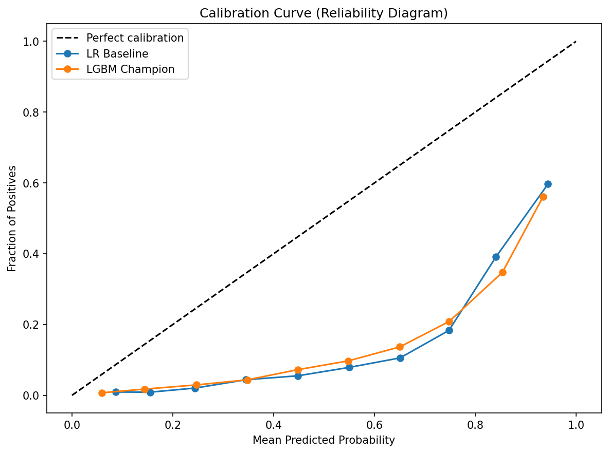

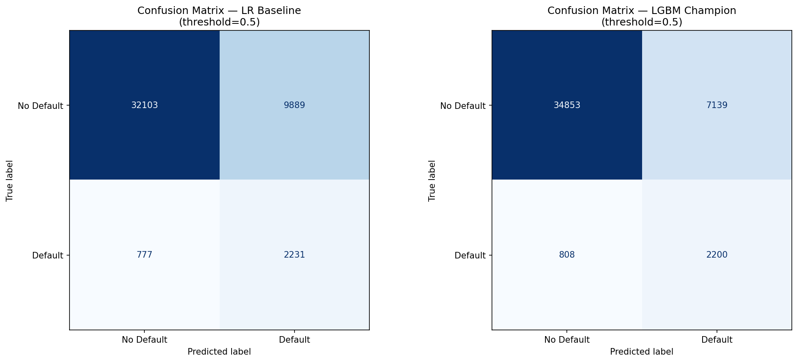

The validation evidence supports the conclusion that the champion is a strong rank-ordering model. However, a production underwriting threshold should not be selected mechanically at 0.50. Threshold selection should reflect credit policy, expected loss, approval capacity, fairness impact, and calibration.

\newpage

# Stability and Sensitivity Analysis

Stability and sensitivity testing are important under SR 11-7 because they indicate whether model outputs are robust to changes in inputs and whether monitoring thresholds are needed.

## PSI Stability

The PSI results indicate stability between training and validation samples. This should be treated as a development check, not production drift evidence. The dataset is randomly split, so near-zero PSI is expected.

## Sensitivity Results

The sensitivity analysis perturbs each input by plus or minus 10% and reports average absolute probability-score movement. It does not measure AUC change.

| Rank | Feature | Average Absolute Score Movement |
|---:|---|---:|
| 1 | age | 0.013805 |
| 2 | RevolvingUtilizationOfUnsecuredLines | 0.011690 |
| 3 | MonthlyIncome | 0.004820 |
| 4 | NumberOfOpenCreditLinesAndLoans | 0.004510 |
| 5 | DebtRatio | 0.003750 |
| 6 | NumberOfTime60-89DaysPastDueNotWorse | 0.001460 |
| 7 | NumberOfTimes90DaysLate | 0.001335 |
| 8 | NumberRealEstateLoansOrLines | 0.000965 |
| 9 | NumberOfDependents | 0.000225 |
| 10 | NumberOfTime30-59DaysPastDueNotWorse | 0.000175 |

The ranking is a material governance finding. Age is the most sensitive feature and is also legally sensitive. This creates a direct link between predictive behavior and fair lending risk.

\newpage

# Fair Lending and Use Risk

Age is the most sensitive input feature in the sensitivity analysis. The disparate impact test compares approval rates across age groups using each model's median predicted default probability as the approval threshold.

## Legal Status of Age Under ECOA

Under the Equal Credit Opportunity Act (ECOA, 15 U.S.C. § 1691) and Regulation B, age is an explicitly permitted factor in empirically derived, statistically sound credit scoring systems. Unlike race, sex, or national origin, age may be used as a direct predictive variable provided the scoring system is based on demonstrated statistical relationships between age and credit performance. The LGBM pipeline is empirically derived from historical default data and satisfies this criterion. Age use in this model is therefore ECOA-compliant and does not constitute unlawful discrimination.

## Disparate Impact Results

| Age Group | Model | N | Default Rate | Approval Rate | AUC | DIR vs Best |
|---|---|---:|---:|---:|---:|---:|
| Young (<30) | LGBM Champion | 2,623 | 12.54% | 24.70% | 0.8189 | 0.3351 |
| Young (<30) | LR Baseline | 2,623 | 12.54% | 22.80% | 0.7814 | 0.3051 |
| Middle (30-60) | LGBM Champion | 27,795 | 8.12% | 39.94% | 0.8459 | 0.5418 |
| Middle (30-60) | LR Baseline | 27,795 | 8.12% | 39.59% | 0.8173 | 0.5297 |
| Senior (>60) | LGBM Champion | 14,582 | 2.89% | 73.72% | 0.8534 | 1.0000 |
| Senior (>60) | LR Baseline | 14,582 | 2.89% | 74.74% | 0.8131 | 1.0000 |

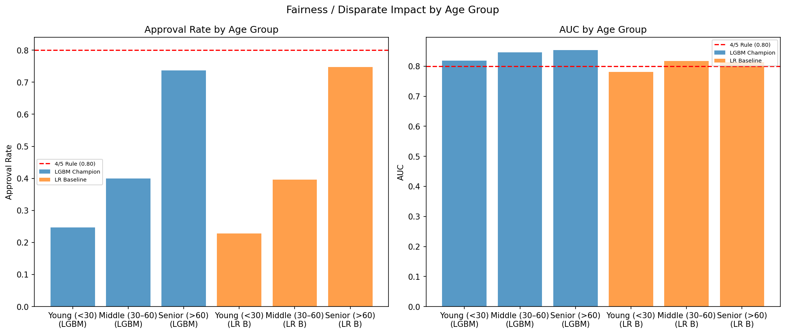

## Interpretation

The young-borrower DIR is 0.3351 for the champion. The four-fifths (0.80) threshold is an EEOC employment-law screening heuristic applied here as a monitoring reference, not a binding credit standard. The DIR gap is consistent with genuine underlying risk differences: young borrowers default at 12.54% versus 2.89% for seniors, a 4.3× difference. The approval rate ratio of 3.0× is proportionally smaller than the default rate ratio, meaning the model is not amplifying the natural risk difference.

## Less-Discriminatory Alternative Test

An age-blind LGBM challenger was trained and evaluated to document whether a less-discriminatory alternative exists with comparable predictive power.

| Model | Overall AUC | Overall KS | Young-Borrower DIR |
|---|---:|---:|---:|
| LGBM Champion | 0.8601 | 0.5700 | 0.3351 |
| LGBM Age-Blind | 0.8229 | 0.5055 | 0.5081 |
| LR Baseline | 0.8317 | 0.5075 | 0.3051 |

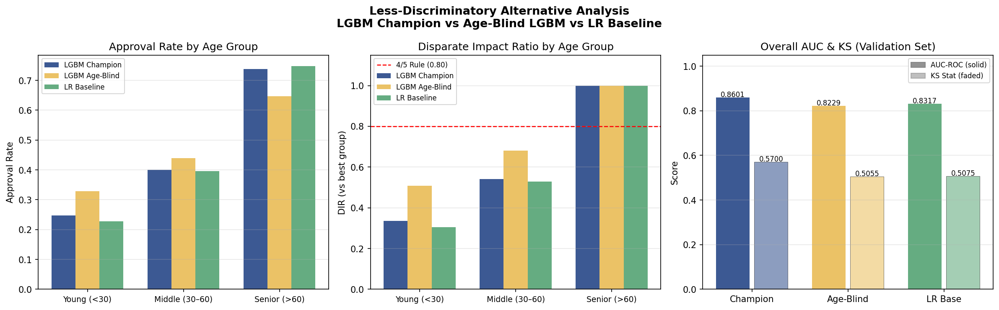

Removing age raises the young-borrower DIR from 0.3351 to 0.5081 (+0.173) but reduces AUC by 0.0372, dropping the champion below the LR baseline. The remaining DIR gap in the age-blind model (0.5081 vs 1.0) is driven by age-correlated legitimate credit factors (utilization, income, delinquency history) and cannot be eliminated without discarding those features. This confirms that age is doing genuine predictive work proportional to actual default rate differences, and that a strict less-discriminatory alternative does not exist without material accuracy loss.

## Fair Lending Finding

Age use is documented as ECOA-compliant. The DIR results are consistent with actual default rate differences and do not indicate unlawful discrimination. Age-based disparate impact should be monitored semiannually to detect any future drift beyond what the underlying default rate differences justify.

\newpage

# Model Risk Tiering

The model is classified as Tier 1 - High Risk under the internal Model Risk Scorecard. The scorecard is not an SR 11-7 formula. It is an internal tiering tool used to determine validation rigor.

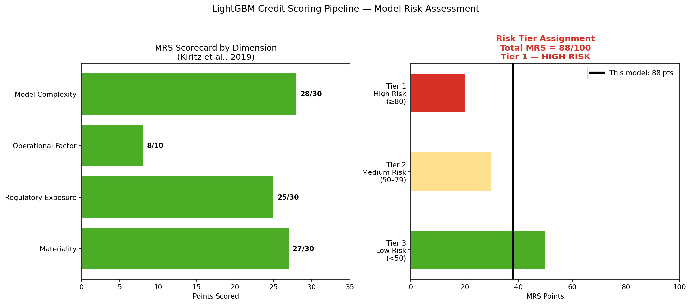

## Scorecard

| Dimension | Max Points | Score | Score % | Justification |
|---|---:|---:|---:|---|
| Materiality | 30 | 27 | 90% | Model affects credit decisions for a large borrower population |
| Regulatory Exposure | 30 | 25 | 83% | SR 11-7, ECOA, explainability, and fair lending exposure |
| Operational Factor | 10 | 8 | 80% | Automated pipeline with no documented override control |
| Model Complexity | 30 | 28 | 93% | LightGBM, WOE clustering, polynomial terms, and feature selection |
| Total | 100 | 88 | 88% | Tier 1 - High Risk |

The Tier 1 rating is appropriate. Credit decisioning is high impact, the model is complex, and the validation has identified both overfitting and fair lending concerns.

\newpage

# SR 11-7 Validation Checklist

The following checklist maps current evidence to SR 11-7 expectations. It is a project control assessment, not an official regulatory certification.

| SR 11-7 Area | Evidence | Status | Action |
|---|---|---|---|
| Purpose and Scope | Credit default probability and intended model use are documented | Pass | Maintain model-use limits in inventory |
| Data Quality | EDA, missingness indicators, outlier caps, and PSI generated | Pass | Document aged Kaggle data as a high limitation |
| Benchmarking | LGBM AUC 0.8601 vs. LR AUC 0.8317; lift 0.0284 | Pass | Explain complexity-performance tradeoff |
| Outcomes Analysis | 5-fold CV confirms systematic overfitting; mean val AUC 0.8297 ± 0.0065, mean gap 0.1669 | Review | Simplify pipeline or apply early stopping before production |
| Ongoing Monitoring | Max validation PSI is 0.0005; thresholds proposed | Pass | Assign production owner and cadence |
| Fair Lending / Use Risk | Age is ECOA-permitted; LDA tested; DIR gap reflects 4.3× actual default rate difference | Pass | Monitor DIR semiannually; document age contribution via SHAP |
| Governance | MRS scorecard and SR 11-7 taxonomy generated | Pass | State independent validation and audit are not performed |

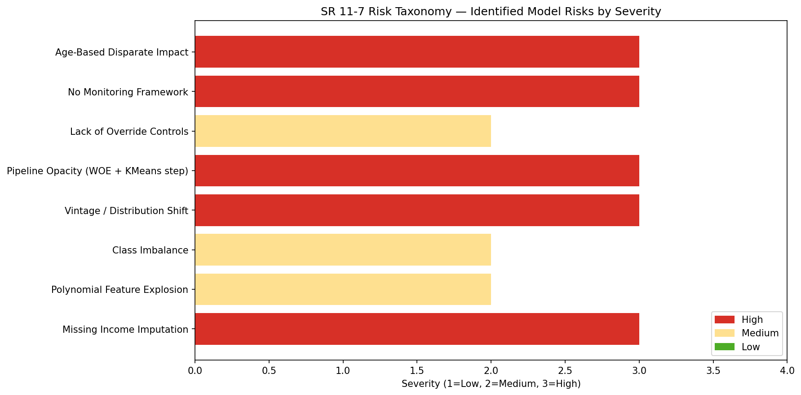

\newpage

# Monitoring and Control Framework

The model should not be deployed without a formal monitoring framework. Monitoring should address data integrity, score behavior, performance, calibration, fairness, and overrides.

| Metric | Frequency | Trigger | Required Action |
|---|---|---|---|
| Feature PSI | Monthly | Any feature > 0.20 | Root cause review |
| Feature PSI | Monthly | Any feature > 0.25 | Revalidation trigger |
| Missingness rate | Monthly | Material deviation from baseline | Data quality review |
| KMeans cluster distribution | Monthly | Cluster share doubles, halves, or empties | Pipeline review |
| AUC-ROC | Quarterly after label maturity | Degradation > 2 percentage points | Performance review |
| KS statistic | Quarterly after label maturity | Degradation > 5 percentage points | Rank-ordering review |
| Brier score | Quarterly | Material deterioration | Calibration review |
| Actual vs. predicted default rate | Quarterly | Deviation > 10% | Recalibration assessment |
| Disparate Impact Ratio | Semiannual | Any group < 0.80 | Fair lending escalation |
| Override rate | Monthly | Unusual level or trend | Policy and manual review assessment |

Monitoring must have accountable owners, evidence retention, escalation paths, and criteria for model change approval. Material changes should be validated before implementation.

\newpage

# Recommendations and Final Opinion

## Completed Validation Work

1. **Age-blind LDA test completed.** Age-blind LGBM trained and evaluated. Young-borrower DIR improves from 0.3351 to 0.5081 at a cost of −0.0372 AUC. Age use confirmed as ECOA-compliant and proportional to actual default rate differences.
2. **Overfitting investigation completed.** 5-fold stratified CV run on training data. Mean val AUC 0.8297 ± 0.0065; mean AUC gap 0.1669. Systematic overfitting confirmed.
3. **SHAP explanation artifacts completed.** Global beeswarm, global bar, and local waterfall plots generated and added to the model evidence package.
4. **Imputation strategy documented and all assumptions validated.** Five assumptions tested: MCAR rejected for both features (missingness is informative, p<0.0001); default rates differ between missing and present groups (ratio 0.81× for income, 0.68× for dependents); extreme right skew (114.04 for income) validates median over mean; no data leakage confirmed; missingness PSI=0.0000 across train/val split. Median imputation confirmed as appropriate. XGB imputation path documented as a sub-model requiring separate validation if used in production.

## Remaining Remediation Before Production

1. Investigate pipeline complexity as the primary driver of overfitting. Apply early stopping, reduce polynomial degree, or reduce n_estimators. Cross-validate any simplified architecture before adopting it.
2. Define production score thresholds based on business cost, expected loss, risk appetite, and calibration. The current median threshold is a validation default, not a policy decision.
3. Establish a human review and override policy for borderline or high-impact decisions.
4. Implement monthly PSI and missingness monitoring and quarterly performance monitoring after outcome labels mature. Assign accountable owners before deployment.
5. Require independent validation and senior model risk sign-off before any real credit decisioning use.

## Final Validation Opinion

The LightGBM champion is a strong predictive model. Age use is ECOA-compliant. SHAP explanations, 5-fold CV overfitting evidence, and a less-discriminatory-alternative test have been completed and are part of the validation evidence package. The remaining production readiness gaps are overfitting, governance controls, and threshold definition. The appropriate validation conclusion is conditional approval pending remediation of those items.

The model is suitable for academic demonstration and model risk case-study analysis. It should be classified as Tier 1 - High Risk and governed with the highest validation rigor if considered for any real-world lending application.

\newpage

# References

Board of Governors of the Federal Reserve System and Office of the Comptroller of the Currency. (2011). Supervisory Guidance on Model Risk Management, SR 11-7. https://www.federalreserve.gov/frrs/guidance/supervisory-guidance-on-model-risk-management.htm

Kaggle. (2011). Give Me Some Credit competition dataset. https://www.kaggle.com/c/GiveMeSomeCredit

Ke, G., Meng, Q., Finley, T., Wang, T., Chen, W., Ma, W., Ye, Q., and Liu, T. (2017). LightGBM: A Highly Efficient Gradient Boosting Decision Tree. Advances in Neural Information Processing Systems.

Kiritz, R., Ravitz, B., and Levonian, M. (2019). Model Risk Tiering.

Project proposal. Model Risk Assessment of Machine Learning-Based Credit Scoring: A Case Study Using the Give Me Some Credit Dataset. Xiaoyang Zhang, Yifan Xu, Yike Ma.
